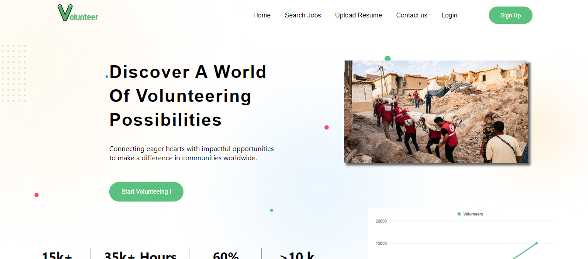
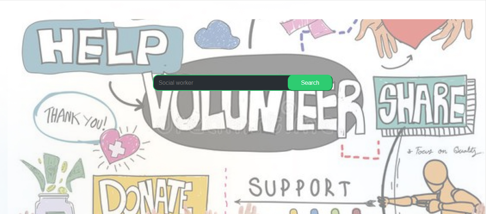
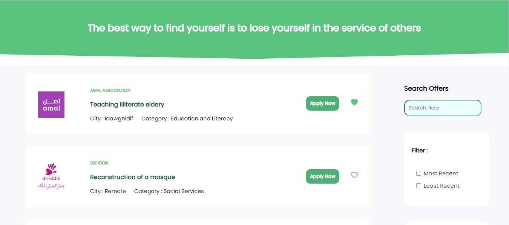
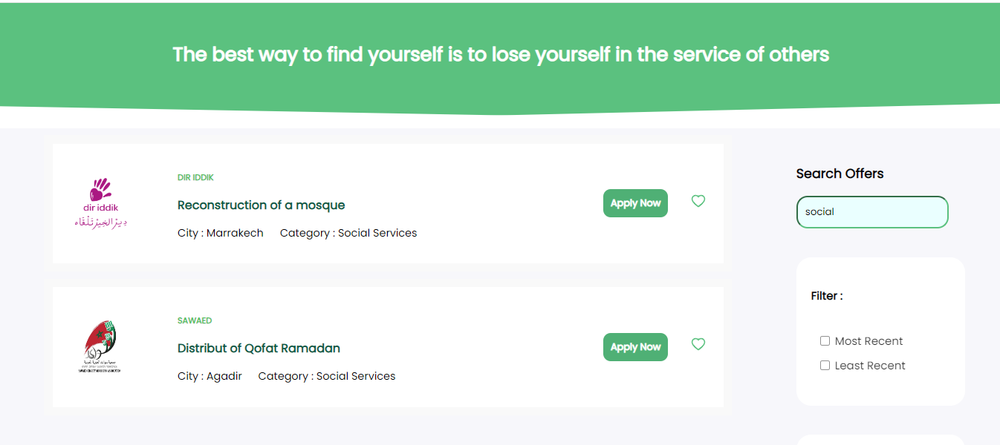
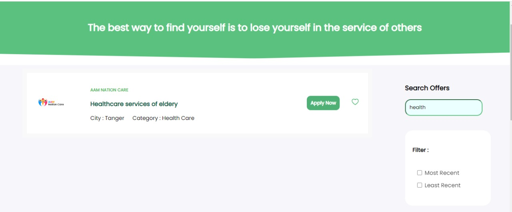
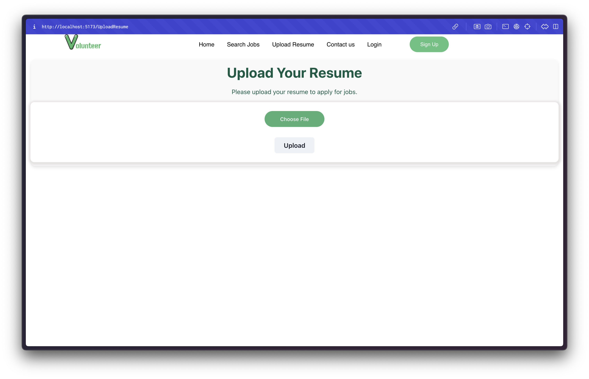
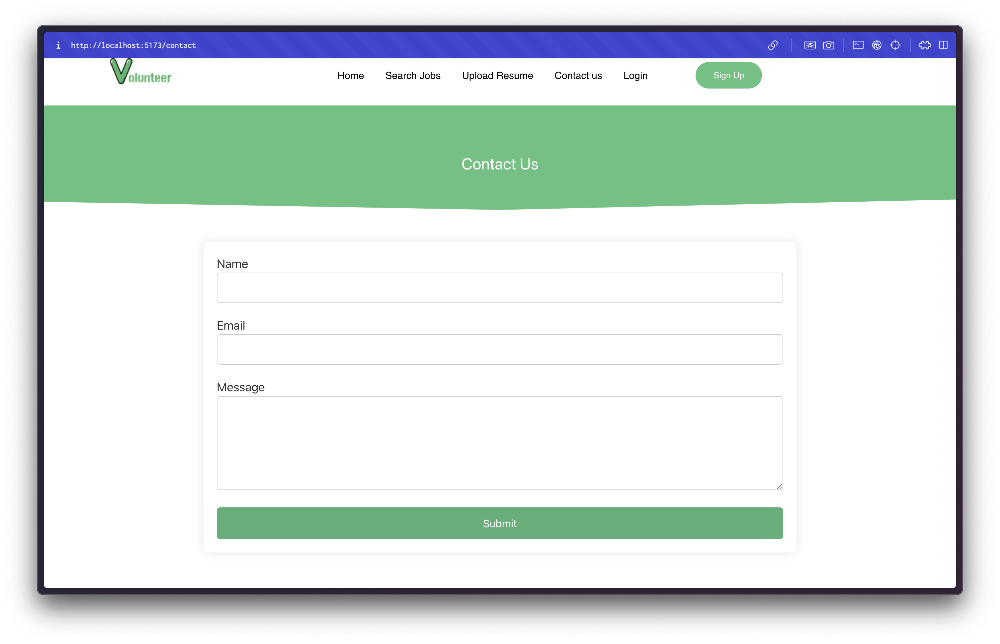
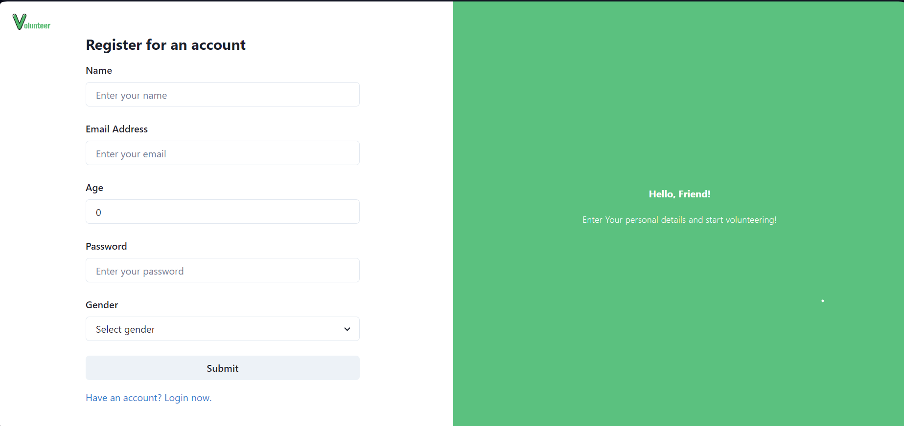
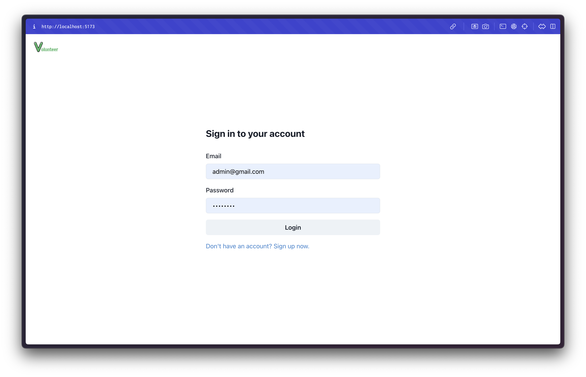

# Volunteer WebSite

Welcome to the Volunteer WebSite! This application helps connect volunteers with organizations and events where they can contribute their time and skills for a good cause.
## Made by:
Laila DAMIR, Ilyas NGOU, Zakaria bahari, Issam hammani

## Problem Statement

In times of crisis, such as earthquakes, the desire to help is often met with challenges in finding trustworthy organizations and coordinating efforts efficiently. VolunteerWeb addresses these issues by providing a centralized platform for volunteers to discover opportunities and for organizations to recruit volunteers effectively.

## Features

### Volunteer Side
- **User Profiles**: Volunteers can create profiles detailing their skills, interests, and availability.
- **Search and Filter**: Easily search for volunteering opportunities based on location, interests, and availability.
- **Matching Algorithm**: An algorithm suggests volunteering opportunities based on user profiles and preferences.
- **Review and Rating System**: Volunteers can rate and review their experiences, helping others make informed decisions.

### Additional Features
- **News and Updates Feed**: Organizations can share updates, while volunteers can stay informed about new opportunities.
- **Tutorial for New Users**: Provides guidance for first-time users on how to navigate the platform effectively.
- **Accessibility Measures**: Supports features like dark mode and ensures simplicity for users with accessibility needs.
- **Success Stories and Testimonials**: Highlights inspiring stories and testimonials from volunteers and organizations.

## Technologies Used

- React.js
- Spring boot
- Spring security
- Chakra UI
- Axios
- Formik
- Yup
- JWT Authentication
## Screenshots

### Home Page

### Upload resume

### Contact us

Description: This is the home page of the Volunteer WebSite, where users can browse available volunteer opportunities.

### Volunteer Registration

### Volunteer login

Description: Users can sign up for volunteer events by filling out a registration form.

